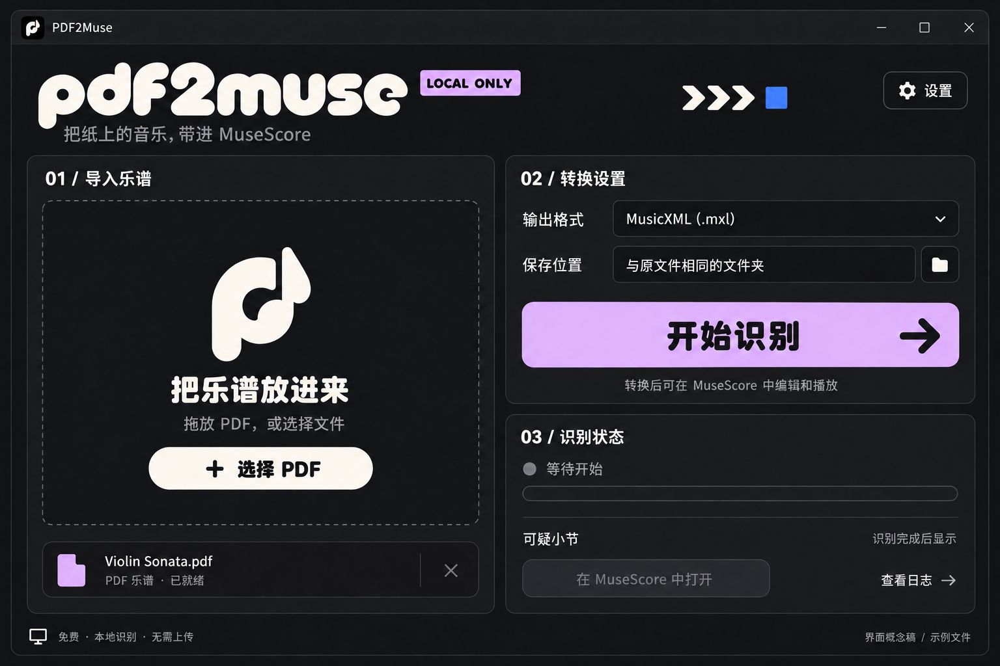

# PDF2Muse / 黑色视觉方案 v2

用户指定方向：黑色为主，参考粗圆字体与赛车贴纸图形的感觉。
当前方案为 PyQt 桌面应用视觉概念稿，后端识别状态仍以首次验证记录为准。

## 主界面



- 炭黑背景、奶白文字、淡紫主按钮，电蓝只作小面积点缀。
- 品牌字标使用极粗、圆润、紧凑的几何字形。参考的是字形特征，尚未确认或选定具体字体。
- 大标题和短按钮可以采用粗圆风格，表单、路径、日志和可疑小节表格保持清楚易读。
- 保留导入、设置、识别状态的功能分区，以 01 / 02 / 03 标签建立顺序。
- 箭头图形只作少量方向提示；装饰文字不占据工作区。
- 文件名为虚构示例；没有生成成功状态、识别率或虚假的进度数字。

## 应用图标


黑色圆角底，奶白色 p 与音符融合的单色图形，右上小块淡紫。
外侧为真实透明通道。该图是概念设计源图；正式应用阶段需制作各尺寸图标资源并检查小尺寸辨识度。
主界面的拖放标记、标题栏小图标与应用图标采用相同图形语言。

## PyQt 样式方向

| 用途 | 色值 |
| --- | --- |
| 窗口 | #141416 |
| 卡片 | #1D1D20 |
| 边框 | #343439 |
| 主文字 | #F4F2EB |
| 次文字 | #A4A4AA |
| 主按钮 | #DDB5FA |
| 主按钮文字 | #141416 |
| 少量点缀 | #4969EA |

实现时以纯色填充代替生成稿中的轻微纹理与明暗变化。
品牌字标可作为独立图形资源，中文字体需验证授权、字形覆盖及 Windows 显示效果，不把图片里的拟字体误称为某个已确定字体。
继续采用 PyQt6 的布局、文件选择、拖放与异步进程能力，控件行为沿用 v1 的设计规范。

## 生成记录

内置 ImageGen；两张用户图片作为风格参考，不复制其原有品牌与贴纸文字。
新版主界面精修了标题栏图标，并精简了右上装饰，最终图使用精修版本。
没有使用 CLI/API fallback。

### 主界面提示词

```text
Use case: ui-mockup.
Asset type: PDF2Muse PyQt Windows desktop application, second visual concept.
Create one high-fidelity straight-on main application window, wide landscape 1536x1024. Use the TWO ATTACHED REFERENCES as visual style references, not content to reproduce.
Reference 1: use its near-black card, very heavy rounded geometric WHITE lettering, tight spacing, playful cutout forms, and small flat lavender label.
Reference 2: extract the black/cream racing-sticker graphic language, compact typography, a few directional arrows and small electric-blue accents. DO NOT draw a vehicle, DO NOT copy any logos, brand names, sticker text, or sale badge from the references.
This design must feel like a small independent creative music utility with confident typographic personality.
STYLE: 85 percent near-black/charcoal, warm off-white typography, flat lavender primary action, tiny electric-blue accent. Flat solid fills only. No gradients, no glowing neon, no glass, no 3D, no grunge or distressed textures. Fine charcoal borders, large calm matte surfaces, strong alignment. Use very bold rounded custom geometric lowercase display lettering for the wordmark "pdf2muse", inspired by the rounded weight and counterforms in reference 1. Brand lettering should have the same confident chubby character rather than generic UI sans. Chinese headings bold but readable; Chinese body uses an uncluttered readable sans serif. Rounded lettering for the BRAND, not novelty lettering everywhere.
COMPOSITION: Entire native Windows application window, minimal 20px exterior margin, no laptop or perspective, no marketing board. A short title bar with "PDF2Muse", minimize/maximize/close controls. Window body #141416, main cards #1D1D20, subtle borders #343439, white #F4F2EB. Roughly 58:42 two-column body. Spacious and practical, no navigation sidebar.
HEADER: At upper left, prominent custom chunky rounded white lowercase wordmark "pdf2muse" on one line, about 330px wide. Place a small rectangular pale-lavender tag reading "LOCAL ONLY" adjacent to it, subtly reminiscent of a sticker, not a sale. Under it in smaller gray Chinese: "把纸上的音乐，带进 MuseScore". Upper right small rounded outlined settings button with gear and text "设置". A small abstract white arrow or circular mark may appear near the header, not decorative clutter.
LEFT CARD: small top label "01 / 导入乐谱". A large inviting black drag-drop zone outlined by a thin dashed gray border. It contains a simple large off-white custom p-to-note monogram, then bold white heading "把乐谱放进来", smaller gray "拖放 PDF，或选择文件". White pill-like button with black lettering "＋ 选择 PDF". Bottom of this card: tidy selected-file row showing tiny lavender file icon, filename "Violin Sonata.pdf", small gray "PDF 乐谱 · 已就绪", small remove X at far right.
RIGHT TOP CARD: label "02 / 转换设置", fields "输出格式" with value "MusicXML (.mxl)", and "保存位置" with value "与原文件相同的文件夹" and a small folder chooser. Dark filled fields with subtle outline and white text. Large full-width pale lavender button #DDB5FA with strong black text "开始识别" and a chunky rightward arrow at right. Under button short gray helper "转换后可在 MuseScore 中编辑和播放".
RIGHT BOTTOM CARD: label "03 / 识别状态". Tiny gray status dot followed by "等待开始". Thin empty progress track. Hairline divider. Text "可疑小节" left and "识别完成后显示" muted right. Disabled charcoal button "在 MuseScore 中打开". Small secondary "查看日志" link with an arrow. No invented successful state, statistics, percentages, or recognition counts.
BOTTOM FOOTER: small local-computer icon and "免费 · 本地识别 · 无需上传"; tiny "界面概念稿 / 示例文件" aligned opposite.
Keep all text sharp and accurate, no gibberish. No user music score content. No accounts, no cloud controls, no paid features, no own music editor, no media player. Use only a handful of tiny graphic details; the dark typographic visual personality must come from proportion, rounded wordmark and high-contrast surfaces, not clutter. This is a usable desktop app interface, not just a poster.
```

### 主界面精修提示词

```text
Use case: precise-object-edit. Edit the attached PDF2Muse dark desktop UI concept with ONLY these two targeted changes:
1. In the very top-left native titlebar, replace the tiny black app icon containing the reference's "ace"-like letters with a miniature of the ORIGINAL off-white p/music-note monogram currently displayed in the center of this app's left drop area. The same p/music-note emblem should be used consistently. No "ace" lettering or any external brand marks.
2. In the upper-right header space BETWEEN the lavender LOCAL ONLY tag and the Settings button, remove the tiny English sentence "SHEET MUSIC TO A BRIGHTER TOMORROW" and the sprawling white/blue sticker cluster. Replace that whole decorative cluster with a single restrained compact grouping of THREE off-white rightward chevrons followed by ONE small flat electric-blue square. Keep generous black negative space. It must look like a small directional graphic, not an advertisement.
Preserve absolutely everything else: same whole Windows window, same positioning, same "pdf2muse" custom heavy rounded wordmark, lavender LOCAL ONLY tag, dark background, lavender primary button, all existing Simplified Chinese text and controls, two-column layout, centered drop area monogram, file row, pending progress state. Keep flat appearance, typography and high fidelity. Do not change button labels or add any new copy.
```

### 图标提示词

```text
Use case: logo-brand.
Asset type: PDF2Muse application icon, dark chunky rounded typographic identity.
Generate a SINGLE original app icon on a square 1024x1024 transparent canvas.
The attached image is ONLY a reference for the identity we just designed. Use the LARGE OFF-WHITE P/MUSIC-NOTE MONOGRAM in the center of its left drop area as the actual icon symbol. Do NOT reproduce any app text or window UI.
Design: one near-black rounded-square tile (#19191C), centered, filling about 86 percent of the square image with a safe transparent margin. Corners rounded about 22 percent of tile width. Fine subtle charcoal outline #343439, no shadow.
Inside the tile, a LARGE WARM OFF-WHITE (#F5F1E8) ORIGINAL LOWERCASE "p" seamlessly merging into a musical note. Match the silhouette concept of the drop-area emblem in the reference: chunky rounded p-shaped body with an open oval/circular counter in its upper bowl and a short descending left stem, with a rounded musical upstem/flag rising on its right. Extremely thick, soft rounded geometric strokes, friendly inflated typography, compact clean negative spaces, same family as the rounded "pdf2muse" wordmark. Make the monogram occupy roughly 65% of tile height and 58% of its width, optically centered. The symbol must read clearly as a hybrid lowercase p and musical note. NOT a conventional thin notation glyph, NOT an existing brand logo, NOT the letters ace.
One small flat pale-lavender rectangular accent may sit at the UPPER-RIGHT edge of the tile as a tiny graphic tab, about 13 percent of tile width. It has no text and must stay within the overall canvas safe margins.
Strict flat two-dimensional geometry with crisp edges and solid colors. No gradients, no photoreal lighting, no sheen, no bevel, no texture, no glow, no drop shadow, no extruded 3D. No wordmark, no titles, no letters other than the monogram shape, no sale label, no music staff, no document-page icon, no folded corner, no extra symbols, no mockup, no presentation sheet, no watermark. Preserve real alpha transparency outside the black tile.
The finished aesthetic should be primarily black and white with a restrained lilac accent: confident, playful, rounded, like an independent creative app with racing-sticker typographic character.
```

