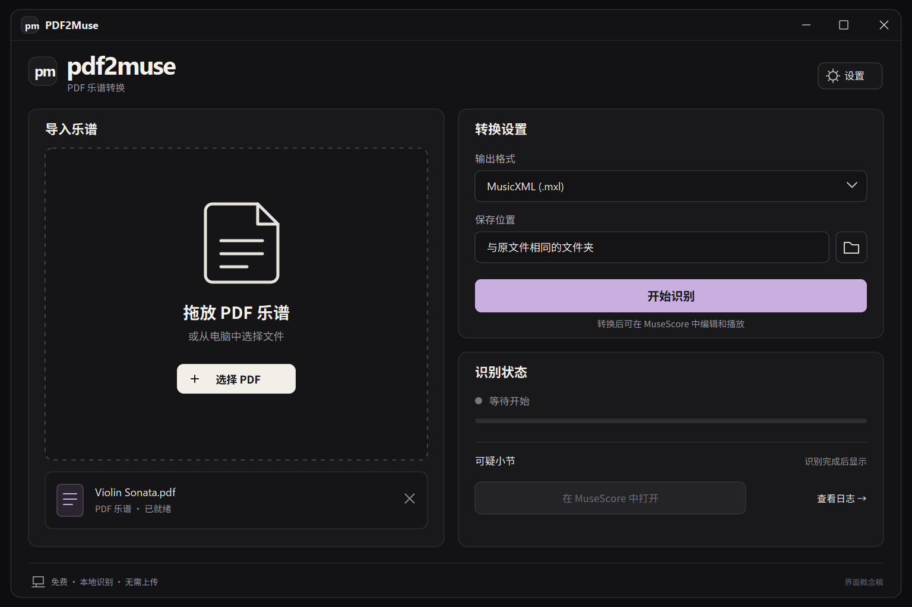
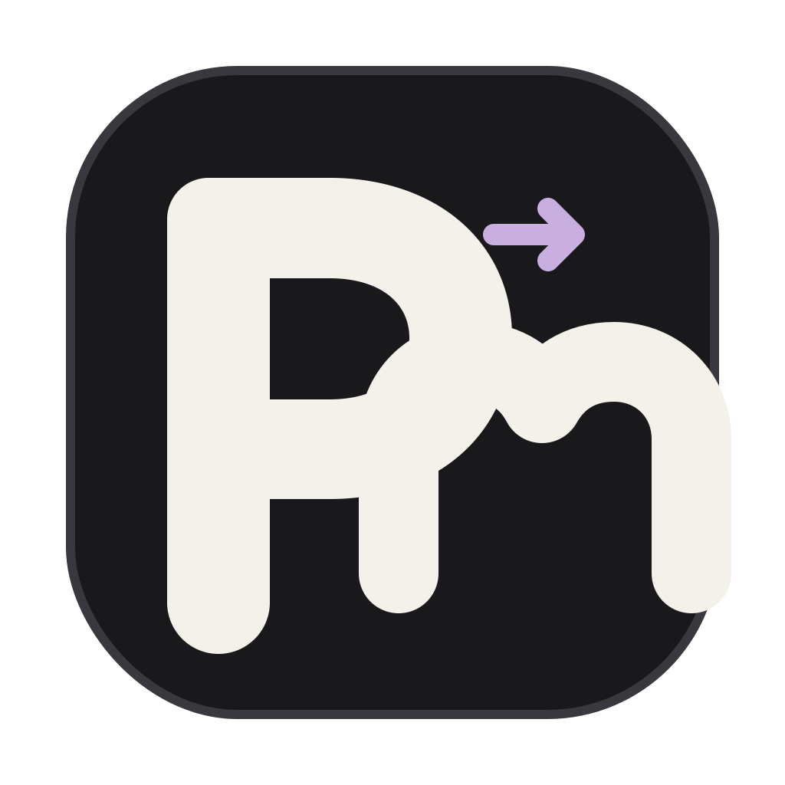

# PDF2Muse / 精致黑色方案 v3

这是当前推荐方案。产品定位是专业、安静的本地转换工具；参考图的个性保留在黑白对比、圆角和紧凑品牌标记中。

## 主界面

主要调整：

- 品牌标题降为正常桌面应用尺寸，取消海报式大字。
- 取消贴纸标签、分区编号、装饰箭头和口号。
- 功能标题、表单、按钮使用中等字重与一致字号。
- 使用纯黑、炭黑、奶白和一处淡紫主按钮；不再使用蓝色点缀。
- 增加留白，统一 1px 边框、圆角、输入框高度和基线。
- 拖放区改用中性的文档图形，避免在工作区重复强调品牌图标。

## 图标

图标不再使用单音符轮廓。设计语义：

- **p**：PDF 输入。
- **m**：Muse / MusicXML 输出。
- 淡紫箭头：本地转换过程。
- 圆润、紧凑的字形呼应用户参考图中的字母构图，但没有复制其中的品牌或文字。

源文件是可编辑的 SVG，可直接继续调整形状，并可导出 Windows ICO 的多尺寸版本。

## 色彩与排版

| 用途 | 色值 |
| --- | --- |
| 窗口 | #131315 |
| 卡片 | #19191C |
| 输入区 | #141416 |
| 边框 | #35353B |
| 主文字 | #F4F1EA |
| 次文字 | #98979F |
| 主操作 | #C8AFE0 |

- 品牌英文：中等偏粗的圆润无衬线，控制在 42px 视觉高度。
- 中文标题：22px / 600。
- 正文与表单：15-18px / 400-500。
- 主按钮：20px / 600，56px 高。
- 基础间距：8px；卡片内边距：28px。

PyQt 实现优先使用 Noto Sans SC 或 Microsoft YaHei UI，英文字标可单独做矢量资源。
