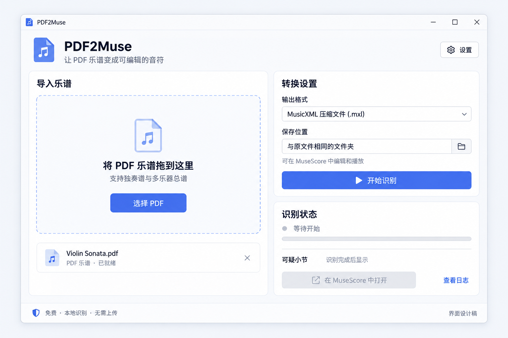

# PDF2Muse 视觉设计 v1

本轮按用户最新要求，将产品形态明确为 **PyQt 桌面应用**，先完成界面与图标设计。
本目录是视觉概念稿；尚未实现 GUI，也不代表 OMR 已验证成功。

## 主界面



- 左侧：拖放区、选择 PDF、当前文件。
- 右侧：输出格式、保存位置、开始识别。
- 右下：识别状态、可疑小节、在 MuseScore 中打开、日志。
- 顶部：应用名称与设置；底部：本地处理说明。
- 示例文件名为虚构数据，未将用户 PDF 内容用于图像生成。
- 界面默认约 1100 × 760，最小约 900 × 680；布局随窗口伸缩。

## 图标


蓝色折角文档与白色音符，表达“乐谱文件变成可编辑音乐”。
PNG 带真实透明通道。当前为设计源图；实施时制作适配 16、24、32、48、64、128、256 px 的应用图标资源。
不要直接把含大块透明留白的画布等比例用作任务栏图标，应按实际图形边界安排安全边距。

## 样式规范

| 项目 | 值 |
| --- | --- |
| 背景 | #F5F7FB |
| 面板 | #FFFFFF |
| 主文字 | #172337 |
| 主色 | #4969EA |
| 次文字 | #788399 |
| 边框 | #DFE5EF |
| 圆角 | 面板 12 px，控件 8 px |
| 字体 | Microsoft YaHei UI / Segoe UI |
| 间距 | 基础 8 px，区块 24 px |

开发时使用纯色填充、细边框与少量阴影；去除生成图中的轻微纹理，落实扁平化样式。

## PyQt 实现映射

以 PyQt6 为拟定实现版本：
QMainWindow + QHBoxLayout/QVBoxLayout；拖放区域用 QWidget 的拖放事件；
QFileDialog 选择输入和输出位置；QComboBox 选择格式；
QProgressBar 显示进度，QPlainTextEdit 显示日志，QTableView 显示可疑小节。
耗时的 Audiveris 通过 QProcess 异步运行，避免界面冻结。

状态依次为：未选择、就绪、识别中、成功（可能需检查）、失败。
只有实际有可用输出时启用“在 MuseScore 中打开”。
不能获取可信页数进度时，显示忙碌状态和当前步骤，不伪造百分比。
设置中预留 Audiveris 和 MuseScore 的自动检测与手动选择。

## 生成方式与提示词

使用内置 ImageGen，两次独立生成；没有使用 CLI/API fallback。

### 主界面提示词

```text
Use case: ui-mockup
Asset type: high-fidelity visual design for PDF2Muse, a real Windows desktop application to be implemented with PyQt.
Primary request: Draw one beautifully polished modern flat desktop app main window, in Simplified Chinese. This is a product UI concept, not a website, not an implementation screenshot. Wide 1536x1024 landscape composition. Show the entire straight-on window centered with a slim neutral outer margin. No perspective, no laptop, no marketing poster, no giant surrounding title. Use Windows window controls minimize/maximize/close at upper right, never macOS traffic-light dots.
Visual direction: restrained modern flat design, very light cool gray background #F5F7FB, white surfaces, strong charcoal typography #172337, one confident indigo-blue accent #4969EA, thin cool-gray borders, subtle shadows only, corner radius 12px, generous clean spacing. No gradients, no glassmorphism, no 3D. Crisp Windows Segoe UI / Microsoft YaHei-style typography, excellent legibility, beautifully aligned controls. Suitable for a compact practical PyQt utility.
Layout and actual UI content:
1. Thin native-looking title bar: small flat blue document-and-note logo and text "PDF2Muse" at left, Windows controls at right.
2. App header below: "PDF2Muse" in medium bold, subheading "让 PDF 乐谱变成可编辑的音符". A discreet outlined gear button labeled "设置" aligned far right.
3. Main body, two columns with approximately 62:38 ratio. Left panel title "导入乐谱", large elegant rounded rectangle drop area with fine dashed blue-gray outline, an understated geometric document icon holding a music note, primary text "将 PDF 乐谱拖到这里", smaller "支持独奏谱与多乐器总谱", prominent blue button "选择 PDF". Beneath the drop area inside the left column is a file row with a small document icon, filename "Violin Sonata.pdf", metadata "PDF 乐谱 · 已就绪", and small remove x. This generic filename is fictional sample data, not an actual conversion result.
4. Right column top settings panel title "转换设置". Format field label "输出格式", selected text "MusicXML 压缩文件 (.mxl)" in dropdown. Output field label "保存位置", selected text "与原文件相同的文件夹", small folder chooser icon. Subtle helper note "可在 MuseScore 中编辑和播放". At bottom of this panel a large full-width blue primary button with play/arrow icon and text "开始识别".
5. Under the settings panel a compact white progress/result panel title "识别状态", tiny neutral dot and text "等待开始", an unfilled thin progress track. Then a fine divider. Row "可疑小节" and muted text "识别完成后显示". A full-width disabled neutral button labeled "在 MuseScore 中打开", secondary link-like text "查看日志". Everything here must clearly look pending; NO successful conversion status or invented counts, no claimed real accuracy.
6. Slim footer separated by hairline: small shield/local-computer icon with text "免费 · 本地识别 · 无需上传" left, tiny text "界面设计稿" right.
Constraints: show exactly one coherent usable app screen with all labels fitting their controls. Prioritize calm spacing and attractive hierarchy over lots of small text. No sidebar navigation, no account/avatar, no cloud upload, no payment, no embedded music editor or player, no source code, no fake percentage or page progress. All Chinese lettering sharp and correct. Do not include any real score or real user's PDF contents.
```

### 图标提示词

```text
Use case: logo-brand
Asset type: PDF2Muse Windows desktop application icon, for a modern flat PyQt application.
Primary request: Design a single beautiful, immediately readable modern flat application icon combining a PDF document silhouette with a musical note. This is the final icon asset, not a branding presentation.
Composition: square 1024x1024 image, true transparent background outside the symbol. One centered bold cobalt-indigo blue document silhouette (#4969EA), with tastefully rounded lower corners and a simple folded top-right corner. The fold is one flat pale periwinkle triangle (#B8C6FF), geometrically aligned to the document edge, with NO shading. The document is about 64% of the canvas width and 78% of its height, optically centered. Place a bold white pair of beamed eighth notes in its lower-middle area, well balanced and instantly recognizable. Musical note construction: two filled oval noteheads, two thick upright stems, and one straight connecting beam. Musical note sits completely inside the page. Generous clear margins. The icon's silhouette and note must remain clearly legible at 32px.
Style: strictly flat vector-like geometry; precise, smooth, clean edges, balanced proportions, premium restrained desktop software branding. EXACTLY three solid colors: indigo body, white note, light periwinkle folded triangle. ABSOLUTELY NO gradients, no lighting, no texture, no glow, no bevel, no drop shadows, no highlights, no 3D, no glossy effects. The document shape itself is the icon; do not put a rounded-square tile behind it.
Constraints: no text, no PDF letters, no wordmark, no border, no checkered pattern painted into the image, no mockup, no desktop background, no multiple icons, no arrows, no watermark. Transparent alpha surrounding the mark. Do not copy the MuseScore or Adobe logo. Produce one isolated original icon asset.
```

